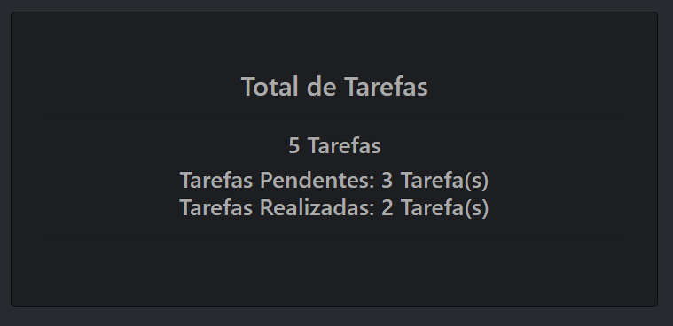
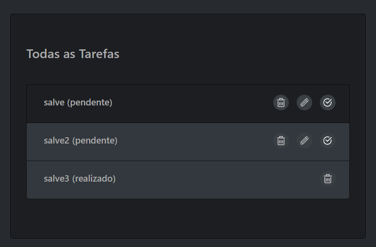
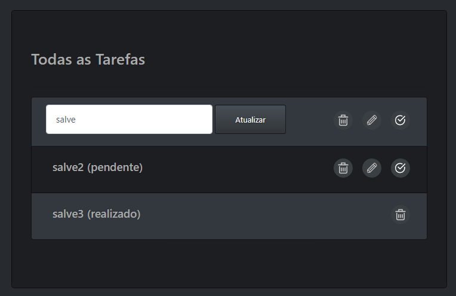

# CRUD de tarefas em PHP


<p align="center">
    <a target="__blank" href="#">
      
    </a>  
    <a target="__blank" href="https://opensource.org/licenses/MIT">
      
    </a>
</p>

## About 

CRUD, build with **PHP7, Bootstrap and MySQl.**

## Images


#### Home

<h1 align="center">
  
</h1>

#### Criar Tarefa

<h1 align="center">
  
</h1>

#### Ver Tarefas

<h1 align="center">
  
</h1>

#### Editar Tarefa

<h1 align="center">
  
</h1>

## DB

PDO set up **connection.php**.

```sql
create table tb_status(
  id int not null primary key auto_increment,
  status varchar(25) not null
);

insert into tb_status(status)values('pendente');
insert into tb_status(status)values('realizado');

create table tb_tarefas(
  id int not null primary key auto_increment,
  id_status int not null default 1,
  foreign key(id_status) references tb_status(id),
  tarefa text not null,
  data_cadastrado datetime not null default current_timestamp
)
```
